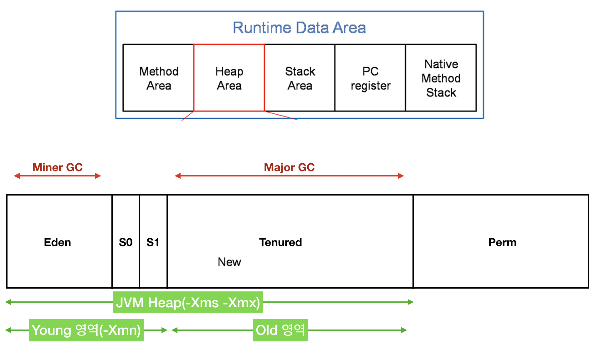

# 3. Garbage Collection
- 앞서 JVM 메모리 구조에 대하여 다뤘다. 
- 이번에는 이 중 Heap Memory 영역을 정리해주는 Garbage Collection 에 대하여 알아보자.

## 3-1. Garbage Collector 란?
- Garbage Collector(이하 GC)는 Heap 메모리 영역의 정리를 위한 장치이다.
- GC는 JVM에서 자동으로 동작하기 때문에, 개발자가 동작할 필요가 없다.
- GC 가 주로 동작하는 대상은 Heap 영역 내의 객체 중에서 참조되지 않은 데이터이다.

###  예제코드 
```java
  public class Main {
    public static void main(String[] args) {
        Person person = new Person("a", "곧 참조되지 않음");
        person = new Person("b", "참조가 유지됨");
        //GC 발생 가정 시점
    }
  }
```
- 앞서 언급한 시점에서 GC가 발생된다면, 어떠한 객체가 메모리에서 해제될까?
- person은 "a"라는 객체를 참조하지만, 곧 "b"라는 객체에 의하여 unreachable 상태가 된다.
- GC는 이러한 unreachable한 객체에 대한 메모리를 해제하는 역할을 한다.

## 3-2. Garbage Collector 의 구조
- GC는 아래의 그림과 같이 크게 3가지로 이뤄져 있다. (Young 영역, Old 영역, Permanent 영역)


### Young 영역 :
- Young 영역은 새로운 객체가 생성되는 곳이다.
- Young 영역은 3가지 부분으로 이뤄져있다. : Eden 1개, Suvivor 2개
- 최근 만들어진 객체는 Eden 영역에 위치하게 된다.
- S0(Survivor0), S1(Survivor1) 중 1개는 온전히 비워진 상태로 대기한다.
- Eden 영역이 가득차게 되면 Minor GC가 일어나게 된다.
#### Minor GC 동작과정 :
  ```
  1. Minor GC가 이뤄진 이후에는 Eden에서 S0 or S1 으로 이동한다.
  2. S0 or S1 중 비워있지 않은 곳의 객체도 반대편 Survivor로 이동시킨다. 
  3. 이로써 한개의 Survivor는 온전히 비워져있는 상태로 존재한다.
  4. Minor GC를 통해 살아남은 객체는 나이를 1살 더 먹게 된다.
  ```


### Old 영역 :
- Minor GC를 당해 1살씩 먹은 객체들이 존재하는 곳이다.
- 몇 살 먹은 객체부터 Old로 이동시킬지 설정할 수 있다.
- Old 영역이 꽉차게 되면 Major GC가 일어나게 된다. (Major GC 의 소요시간 >>> Minor GC 의 소요시간)

### Permanent 영역 :
- Perm 영역은 각각의 OS, JVM 버전 마다 다른 크기를 default로 가지고 있다.
- Class 나 Method 의 메타 정보를 가지고 있다.
- JDK 8 버전부터 MetaSpace 로 그 명칭이 변경되었다.

### MetaSpace 영역 :
- Permanent 영역의 바뀐 버전이다.
- Permanent 와 달리 크기가 필요에 따라 자동으로 변화한다.

## 3-3. Garbage Collecto 의 특징
### Stop the World
- 모든 GC는 해당 이벤트를 발생시킨다.
- 해당 이벤트가 발생하게 되면 모든 Thread가 동작을 멈춘다.
-  Minor GC 는 수명이 짧은 적은 수의 객체에 대하여 검사를 진행하기에 소요시간이 적다.
-  Major GC 는 살아있는 모든 객체에 대하여 검사를 진행하기에 소요시간이 오래 걸린다. (통상 Minor GC의 10배 가량 소요)

### GC 활용 방법
- 앞서 말했듯이 Major GC는 Minor GC에 비해 통상 10배 가량 많은 시간을 잡아먹는다.
- 이는 TimeOut 을 유발하며, 적절한 튜닝을 통하여 Major GC의 발생빈도를 줄여야한다.
- Major GC를 줄이기 위하여 수시로 모니터링하는 것이 필요하다.

  #### GC 활동 모니터링이란?
  - 우선 GC를 모니터링하기 위해서는 PID 가 필요하다.
  - PID 를 이용한 GC 모니터링 명령어는 다음과 같다. (GUI에서도 가능하지만, 이 방법은 생략한다.)
  ```bash
  $ jstat -gc [PID] [출력주기(ms)]
   S0C    S1C    S0U    S1U      EC       EU        OC         OU       PC     PU    YGC     YGCT    FGC    FGCT     GCT
  1024.0 1024.0  0.0    0.0    8192.0   7933.3   42108.0    23401.3   20480.0 19990.9    157    0.274  40      1.381    1.654
  1024.0 1024.0  0.0    0.0    8192.0   8026.5   42108.0    23401.3   20480.0 19990.9    157    0.274  40      1.381    1.654
  1024.0 1024.0  0.0    0.0    8192.0   8030.0   42108.0    23401.3   20480.0 19990.9    157    0.274  40      1.381    1.654
  1024.0 1024.0  0.0    0.0    8192.0   8122.2   42108.0    23401.3   20480.0 19990.9    157    0.274  40      1.381    1.654
  1024.0 1024.0  0.0    0.0    8192.0   8171.2   42108.0    23401.3   20480.0 19990.9    157    0.274  40      1.381    1.654
  1024.0 1024.0  48.7   0.0    8192.0   106.7    42108.0    23401.3   20480.0 19990.9    158    0.275  40      1.381    1.656
  1024.0 1024.0  48.7   0.0    8192.0   145.8    42108.0    23401.3   20480.0 19990.9    158    0.275  40      1.381    1.656
  ```
  - 각 수치가 의미하는 바는 아래와 같다. :
    - S0C 와 S1C : Survivor0과 Survivor1 영역의 사이즈
    - S0U 와 S1U : Survivor0과 Survivor1 영역에서 사용하고 있는 사이즈 (둘중 하나는 항상 비어있음)
    - EC 와 EU : EC는 Eden 영역의 사이즈 (EU -> Eden Usage)
    - OC 와 OU : OC는 Old 영역의 사이즈 (OU -> Old Usage)
    - PC 와 PU : PC는 Permanent 영역의 사이즈
    - YGC와 YGCT : YGC는 young 영역 안에 GC가 일어난 횟수, YGCT는 Young 영역안에서 GC의 누적시간 
    - FGC and FGCT : FGC는 Full GC가 일어난 횟수, FGCT는 Full GC 의 누적 시간
    - GCT : 모든 GC가 걸린 누적 시간 (YGCT + FGCT)
  - 이를 활용한 GC 튜닝의 예시는 다음과 같다. :
    - 만약 Full GC 가 많이 일어난다 ? -> Old 영역의 크기를 늘려준다.

## 3-4. 유의사항
- GC 튜닝은 많은 시간과 노력이 소요되며, 이에 대한 정답은 없으나, "최후의 보루"로 신중하게 사용하여야 한다.

### 3-5. 출처
- 자바의 JVM 구조와 Garbage Collection : https://donghyeon.dev/java/2020/03/31/%EC%9E%90%EB%B0%94%EC%9D%98-JVM-%EA%B5%AC%EC%A1%B0%EC%99%80-Garbage-Collection/
- JVM에 관하여 - Part 4, Garbage Collection 기초 : https://tecoble.techcourse.co.kr/post/2021-08-30-jvm-gc/
