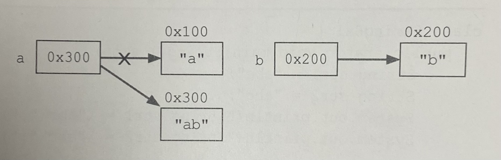

# 1. java.lang 패키지

java.lang 패키지는 자바 프로그래밍에 가장 기본이 되는 클래스들을 포함하고 있다. 따라서 해당 패키지들은 import문 없이도 사용할 수 있다. Object 클래스는 모든 클래스의 최고 조상이기 때문에 Object 클래스의 멤버들은 모든 클래스에서 바로 사용이 가능하다.

## 1-1. Object 클래스의 메서드

### 1) equals(Object obj)
이 메서드는 매개변수로 객체의 참조변수를 받아서 비교하고 그 결과를 boolean 값으로 반환하는 메서드이다. 원래는 두 객체의 같고 다름을 주소값으로 비교한다. 따라서 같은 Value를 가지는 인스턴스의 equals() 결과는 항상 false가 나오도록 설계되어 있다. 두 개의 인스턴스가 가르키는 주소값은 다르기 때문이다. 허나 우리가 주로 equals()를 사용하는 경우는 주로 String의 비교를 원할 경우이다. 해당 경우에는 값이 같디면 true가 나온다. 그 이유는 String 클래스에서는 Object클래스의 equals() 메서드를 Override하여 사용하였기 때문이다. equals() 를 Override 할 경우, hashCode() 도 재정의 해줘야 한다. 그렇지 않으면 이상한 결과값이 나올 수 있다. equals() 내에서 Hash를 사용하기 때문이다.

### 2) hashCode() 
이 메서드는 해싱기법에 사용되는 '해시함수'를 구현한 것으로, 다량의 데이터를 저장하고 검색하는 데에 유용하다. 해시 함수는 찾고자하는 값을 입력하면, 그 값이 저장된 위치를 알려주는 해시코드를 반환한다. 마찬가지로 String 클래스에서는 hashCode() 메서드를 Override 하여 사용하고 있기에 값이 같다면 동일한 해시코드를 반환한다(같은 RunTime 내에서). 객체의 주소라고 생각하면 편하다.

### 3) toString() 
이 메서드는 인스턴스에 대한 정보를 문자열로 제공하는 메서드이다. 아래의 코드는 Object 클래스 내의 toString() 메서드에 대한 코드이다. 
##### PrintStream(ex. sysout) 에서는 toString()을 자동으로 붙혀준다. 

```java
public String toString() {
  return getClass().getNmae()+"@"+Integer.toHexString(hashCode());
}
```

즉, toString() 메서드는 16진수의 해시코드를 얻게된다. 그러나, 마찬가지로 String 클래스의 toString()메서드는 인스턴스 클래스에 대한 정보가 아닌 인스턴스 변수들의 값을 문자열로 변환하여 반환하도록 Override 되어 있다. 

### 4) getClass()
이 메서드는 자신이 속한 Class객체를 반환하는 메서드이다. 예를 들어, Class 객체는 이름이 'Class'인 클래스의 객체이다. Class 객체는 클래스의 모든 정보를 담고 있으며, 클래스당 1개만 존재한다. 그리고 클래스 파일이 '클래스 로더(ClassLoader)'에 의하여 메모리에 올라갈 때 자동으로 생성된다. 먼저 기존에 생성된 클래스 객체가 메모리에 존재하는지 확인하고, 있으면 객체의 참조를 반환, 없다면 클래스 패스에 지정된 경로를 따라서 클래스 파일을 찾는다. 만약 해당 클래스 파일이 존재하지 않을 경우 ClassNotFoundException이 발생하고, 찾으면 클래스 파일을 읽어서 Class 객체로 변환한다. 즉 클래스 파일을 읽어서 사용하기 편한 형태로 저장해 놓은 것이 클래스 객체이다.

#### Class 객체를 얻는 방법
```java
 Class class = new Card().getClass(); // 생성된 객체로부터 얻는 방법
 Class class = Card.class;            // 클래스 리터럴(*.class)로 부터 얻는 방법
 Class class = Class.forName("Card"); // 클래스 이름으로부터 얻는 방법
```


## 1-2. String 클래스

#### 변경 불가능한(immutable) 클래스
String 클래스에는 문자열을 저장하기 위해서 문자형 배열 참조변수(char[]) value를 인스턴스 변수로 정의해두고 있다. 인스턴스 생성 시 생성자의 매개변수로 입력받는 문자열은 이 인스턴스 변수(value)에 문자형 배열(char[])로 저장되는 것이다. 따라서 한번 생성된 String인스턴스가 가지고 있는 문자열은 읽어 올 수만 있고, 변경할 수는 없다. ~~또한 String 은 final로 생성되어 있으므로 다른 클래스의 조상 클래스가 될 수 없다.~~
```java
public final class String implements java.io.Serialize, Comparable {
  private char[] value;
  ...
}
```

예를 들어 아래의 코드와 같이 '+'연산자를 이용하여 문자열을 결합하는 경우 인스턴스 내의 문자열이 바뀌는 것이 아니라 새로운 문자열('ab')이 담긴 String 인스턴스가 생성되는 것이다.

<p align="center">
  
</p>

이처럼 덧셈연산자를 사용하여 문자열을 결합하는 것은 매 연산시 마다 새로운 문자열을 가진 String 인스턴스가 생성되어 메모리 공간을 차지하게 되므로 가능한 한 결합 횟수를 줄이는 것이 좋다. 문자열 간의 결합이나 추출 등의 **문자열을 다루는 작업이 많이 필요한 경우에는 String 클래스 대신 StringBuffer클래스를 사용하는 것이 좋다.**

#### 문자열의 비교
문자열을 만드는 방법에는 두 가지 방법이 존재한다. 
```java
String str1 = "abc";
String str2 = "abc";
String str3 = new String("abc");
String str4 = new String("abc");
```
String 클래스의 생성자를 이용한 경우에는 new 연산자에 의하여 메모리 할당이 이뤄지기 때문에 새로운 String 인스턴스(str3, str4)가 생성된다. 그러나 문자열 리터럴(str1, str2)은 이미 존재하는 것을 재사용하는 것이다. 때문에 아래와 같이 equals() 메서드를 통한 비교와 등가연산자("==")를 통한 비교에 차이가 발생한다.

```
String str1 = "abc";
String str2 = "abc";
str1 == str2 ? true
str1.euqals(str2) ? true

String str3 = new String("abc");
String str4 = new String("abc");
str3 == str4 ? false
str3.euqals(str4) ? true
```

#### 빈 문자열
길이가 0인 배열이 존재할 수 있다. 따라서 String s = ""; 일 때, 참조변수 s가 참조하고 있는 String 인스턴스는 내부에 new char[0] 과 같이 길이가 0인 char형 배열을 저장하고 있는 것이다. 일반적으로 인스턴스 초기화 시 String은 ""(빈문자열) 으로, char형은 " "(공백)으로 초기화하는 것이 보통이다.

### 1) join()
join()은 여러 문자열 사이에 구분자를 넣어서 결합한다. 구분자로 문자열을 자르는 split()와 반대의 작업을 한다고 생각하면 이해하기 쉽다.

### 기본형 값을 String으로 변환
기본형을 문자열로 변경하는 방법에는 두 가지 방법이 존재한다. 하나는 빈 문자열을 더하는 방법이고, 하나는 valueOf() 메서드를 사용하는 방법이다. 빈 문자열을 더하는 것은 앞서 말했듯이 하나의 새로운 인스턴스가 생성되므로 성능이 중요한 경우에는 valueOf() 메서드를 사용하도록 하자.

## 1-3. 래퍼(wrapper) 클래스
때로는 기본형(primitive) 변수도 어쩔 수 없이 객체로 다뤄져야하는 경우가 있다. 예를 들어, 매개변수로 객체를 요구할 떄, 기본형 값이 아닌 객체로 저장하여야 할 때 등이 있다. 이 때에는 기본형 값들을 객체로 변환하여 작업을 수행하여야 한다. 이 때 사용하는 것이 래퍼 클래스이다. 이 클래스를 사용하면 기본형 클래스를 객체로 다룰 수 있다. 래퍼 클래스들은 모두 equals()가 오버라이딩되어 있어서 주소값이 아닌 객체가 가지고 있는 값을 비교한다. 

#### 오토박싱과 언박싱
JDK1.5 이전에는 기본형과 참조형 간의 연산이 불가능했기에 래퍼 클래스로 기본형을 객체로 만들어서 연산하여야 했다. 그러나 이제는 기본형과 참조형 간의 덧셈이 가능해졌다. 이는 자바 언어의 규칙이 바뀐 것이 아닌 컴파일러가 자동으로 변환하는 코드를 넣어주기 때문이다. 
```java
/** Before) **/
int i = 5;
Integer obj = new Integer(7);

int num = i + obj;

/** After) **/
int i = 5;
Integer obj = new Integer(7);

int num = i + obj.intValue();   // intValue() 메서드가 들어간 것을 확인할 수 있음
```

# 2. 유용한 클래스

## 2-1. java.util.Objects
### 1) isNull / nonNull
isNull()은 해당 객체가 널인지 확인해서 null이면 true를 반환하고, 아니라면 false를 반환한다. isNull()과 nonNull()은 반대의 역할을 한다.

### 2) requireNonNull()
requireNonNull() 은 해당 객체가 Null이 아니여야 하는 경우에 사용한다. 만일 객체가 널이면 NPE를 발생시킨다. 두 번째 매개변수로 지정하는 문자열은 예외의 메세지가 된다.
```java
void(String name) {
  this.name = Objects.requireNonNull(name, "Name must not be null");
}
```

### 3) Objects 클래스 내 equals()
Object 클래스에 정의된 equals() 메서드가 Objects에도 존재한다. 이 메서드의 장점은 null 체크를 하지 않아도 됨에 있다.
```java
/** Before **/
if(a != null && a.equals(b)) {
  ...
}

/** After **/
if(Objects.equals(a, b)) { // 매개변수의 값이 null인지 확인할 필요가 없다.
  ...
}
```
