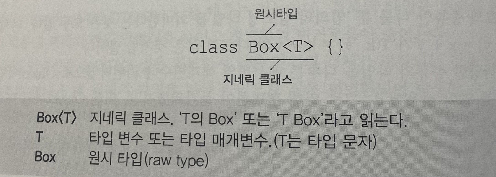

# 1. Generic

## 1-1. Generic 이란?
- Generic는 다양한 타입의 객체들을 다루는 메서드나 컬렉션 클래스에 컴파일 시의 타입 체크를 해주는 기능이다. 
- 컴파일 시에 체크하기 때문에 객체의 타입 안정성을 높이고 형 변환의 번거로움이 줄어든다.

### Generic 장점
  1) 타입 안정성을 제공한다.
  2) 타입 체크와 형변환을 생략할 수 있으므로 코드가 간결해 진다. (캐스트 제거 가능)

###### ~~뭐든지 말로 들으면 이해가 잘 가지 않으니 예시를 통하여 이해하자.~~

#### 1) 타입 안정성을 제공한다.
인스턴스를 만들 때 타입을 지정했기 때문에 런타임 오류를 방지할 수 있다. 발생할 수 있는 오류를 컴파일 과정에서 알 수 있다.
```java 
public class Box {
  private Object object;
  public void set(Object object) { this.object = object; }
  public Object get() { return object; }
}

Box box = new Box();
box.set(30);                         // Box 의 object를 int형으로 지정
try{
    String s1 = (String) box.get();  // 런타임 에러 발생
}
catch(Exception e){
    System.out.println("Exception " + e);
}
```

```
결과 : Exception:
      java.lang.ClassCastException:
      java.lang.Integer cannot be cast to java.lang.String
```

#### 2) 캐스팅을 제거할 수 있다.
```java
/** Generic 을 사용하지 않은 경우 **/
public class Box {
    private Object object;
    public void set(Object object) { this.object = object; }
    public Object get() { return object; }
}

Box box = new Box();
box.set("hello");
String s = (String) box.get(); // 값을 불러오기 위해서 캐스팅이 필요함
```

```java
/** Generic 을 사용한 경우 **/
public class Box<T> {
	private T t;
	public void set(T t) { this.t = t; }
	public T get() { return t; }
}
Box<String> box = new Box<String>();
box.set("hello");
String s = box.get();   // 캐스팅 제거 가능 : 타입에 대하여 명시하였기 때문
```

### Generic  타입 매개 변수 명명 규칙
Generic 에는 다양한 매개 변수가 존재할 수 있다. 강제되는 사항은 아니지만 **아래와 같이 상황에 맞는 의미있는 문자를 선택하여 사용하는 것이 좋다.** 주로 사용되는 명명 규칙의 예시는 다음과 같다. T는 타입 변수("Type Variable") 의 첫글자에서 따온 것이다. 마찬가지로, 배열에서의 ArrayList<E>는 Element, Map<K, V>에서는 각각 Key, Value를 의미한다.

###### 타입 매개 변수 명명 규칙 
```
T - Type
E - Element
K - Key
V - Value
N - Number
```

### Generic의 예시
아래와 같이 기존 클래스를 Generic 타입의 클래스로 선언할 수 있다.
```java
/** Before **/
class Box {
  Object item;
  
  void setItem(Object item) {
    this.item = item;
  }
  
  Object getItem() {
    return item;
  }
}

/** After **/
class Box<T> {
  T item;
  
  // Box 의 멤버변수의 자료형을 자유롭게 지정할 수 있다.
  void setItem(T item) {
    this.item = item;
  }
  
  T getItem() {
    return item;
  }
}
```

Generis 클래스가 된 Box클래스의 객체를 생성할 때는 다음과 같이 참조변수와 생성자에 타입 T 대신에 사용될 실제 타입을 지정하면 된다.

```java
/** Usage **/
Box<String> b = new Box<String>();  // 실제 타입 지정
b.setItem("ABC");                   // if) b.setItem(new Object()); -> ERROR 발생, String으로만 지정 가능
String item = b.getItem();          // 형변환 생략가능
```

String으로 지정하였으므로 아래와 같이 정의된 것과 같다.

```java
class Box {
  String item;
  
  void setItem(String item) {
    this.item = item;
  }
  
  String getItem() {
    return item;
  }
}
```
  
## 1-2.Generics 관련 용어
타입 문자 T는 Generic 클래스 Box<T>의 타입 변수 또는 타입 매개변수라고 한다. 메서드의 매개변수와 유사한 면이 있기 때문이다. 그래서 아래와 같이 타입 매개변수에 타입을 지정하는 것을 '지네릭 타입 호출'이라고 하며, 지정된 타입(ie.String)를 '매개 변수화된 타입'이라고 한다.

<p align="center">
  
</p>

## 1-3. Generic 제거
Generic 사용 시 아래의 예시와 같이 오버로딩을 사용할 수 있을까? 아래의 메서드는 서로 다른 Generic 타입 매개 변수를 사용하고 있다.
```java
Juice makeJuice(FruitBox<Fruit> Box) {
  Strung tmp = "";
  for (Fruit f : box.getList()) {
    tmp += f + " ";
    return new Juice(tmp);
  }
}
  
Juice makeJuice(FruitBox<Apple> Box) {
  Strung tmp = "";
  for (Fruit f : box.getList()) {
    tmp += f + " ";
    return new Juice(tmp);
  }
}
```  
**결론부터 말하자면 오버로딩할 수 없다.** 컴파일 에러가 발생한다. 왜냐면 Generic 타입은 컴파일러가 컴파일할 때만 사용되고 제거되기 때문이다. 따라서 .class 파일에는 Generic 관련 코드가 남지 않는다. 이렇게 컴파일 단계에서 Generic 코드를 제거하는 이유는 Generic을 사용하지 않는 기존 코드와의 호환성을 유지하기 위함이다. 따라서 위의 경우에는 메서드 중복 정의로 인한 오류가 발생한다. 

## 1-4. 제한된 Generic 클래스
타입 매개변수 T 에 지정할 수 있는 타입의 종류를 제한할 수 있는 방법이 존재한다. 유연성을 위하여 Generic을 사용하지만 제한이 없는 Generic은 오류를 발생시킬 수 있다. 이를 방지하기 위해선 'extends'를 사용하는 것이다. 아래의 코드와 같이 사용하면 특정 타입(Fruit)의 자손들만 대입할 수 있도록 제한(상한제한)할 수 있다.
```java
// Fruit의 자손타입만 지네릭 매개변수로 들어갈 수 있다.
class FruitBox<T extends Fruit> {
  ArrayList<T> list = new ArrayList<T>(); 
}  
```	
	
## 1-5. 와일드카드
와일드카드를 통하여 Generic 클래스의 객체를 메소드의 매개변수로 받을 때, 그 객체의 타입 변수를 제한할 수 있다. "?" 기호를 사용한다.
```
  <? extends T> : 상한제한, T와 그 자손들만 가능
  <? super T>   : 하한제한, T와 그 조상들만 가능
  <?>           : 제한없음, 전체 타입 가능
	
  [ 참고 ]
    - extends : 꺼내는 것만 가능해 (get)
    - super   : 넣는 것만 가능해   (set)
```


아래의 예시와 같이 Generic 메소드의 매개변수를 제한할 수 있다. (Fruit 혹은 Fruit의 자식)
```java
public Juice makeJuice(FruitBox<? extends Fruit> box) {
  String tmp = "";
  for(Fruit f : box.getList()) {
    temp += f + " ";
  }
  return new Juice(tmp);
}
```

### 제네릭 타입<T>와 와일드 카드<?>의 차이는?
1) 제네릭 : 타입을 모르지만, 타입을 정해지면 그 타입의 특성에 맞게 사용한다. (add(), addAll()과 같은 타입 파라미터와 결부된 기능도 사용하겠다.)
2) 와일드 카드 : 무슨 타입인지 모르고, 무슨 타입인지 신경쓰지 않는다. 타입을 확정하지 않고 가능성을 열어둔다. (size(), clear()와 같은 인터페이스에 정의되어 있는 기능만 사용하겠다.)

## 1-6. Generic Method

#### "클래스의 제네릭 타입이 전역 변수처럼 사용된다면 메소드의 제네릭 타입은 해당 메소드 안에서만 사용할 수 있는 지역성을 갖는다."
앞선 제네릭 타입 매개변수는 static 멤버에는 사용할 수 없다. static은 인스턴스가 생성되기 전에 메모리에 올라가 있기 때문에 인스턴스 생성 시에 타입이 결정되는 제네릭 클래스는 사용할 수 없다. 이러한 제한 사항을 Generic Method를 통하여 해결할 수 있다. 아래의 두번째 예시처럼 매개변수가 아닌 메서드에 Generic 타입을 선언하고 사용하는 것은 가능하다. 제네릭 메소드는 호출되는 시점에 타입이 결정되기 때문이다.

##### 앞서 나온 makeJuice() 메서드를 Generic 메서드로 바꾸는 코드는 다음과 같다.

```java
/** Before : 사용불가 -> 인스턴스 생성시에 타입이 결정됨  **/
static Juice makeJuice(FruitBox<T> box) {
  String tmp = "";
  for(Fruit f : box.getList()) {
    temp += f + " ";
  }
  return new Juice(tmp);
}

/** After : 사용가능 -> 호출시점에 타입이 결정됨 **/
static <T> Juice makeJuice(FruitBox<T> box) {
  String tmp = "";
  for(Fruit f : box.getList()) {
    temp += f + " ";
  }
  return new Juice(tmp);
}
```
	
##### 이렇게 생성된 Generic Method를 호출할 때는 아래와 같이 타입 변수에 타입을 대입하여야 한다.

```java
FruitBox<Fruit> fruitBox = new FruitBox<Fruit>();
FruitBox<Apple> appleBox = new FruitBox<Apple>();
...
System.out.println(Juicer.<Fruit>makeJuice(fruitBox));
System.out.println(Juicer.<Apple>makeJuice(appleBox));
```

#### static 변수에는 제네릭을 사용할 수 없지만 static 메서드에는 제네릭을 사용할 수 있는 이유가 무엇일까요?

```
static 변수의 경우에는 앞에서 이야기한 것처럼 제네릭을 사용하면 여러 인스턴스에서 어떤 타입으로 공유되어야 할지 지정할 수가 없어서 사용할 수 없었습니다. 
static 변수는 값 자체가 공유되기 때문에 값 자체가 공유되려면 타입에 대한 정보도 있어야 하기 때문입니다.
반면 static 메서드의 경우 메서드의 틀만 공유된다고 생각하면 됩니다.
그리고 그 틀 안에서 지역변수처럼 타입 파라미터가 다양하게 오가는 형태로 사용될 수 있는 것입니다.
	
출처 : https://wildeveloperetrain.tistory.com/103
```


또한 이와 같은 Generic Method는 매개변수 타입이 복잡할 경우에 유용하게 사용할 수 있다.

```java
/** Before **/
public static void printAll(
          ArrayList<? extends Product> list1, 
          ArrayList<? extends Product> list2) {
  ...
}

/** After **/
public static <T extends Product>void printAll(
          ArrayList<T> list1, 
          ArrayList<T> list2) {
  ...
}
```

# Source 
- 제네릭의 개념: http://www.tcpschool.com/java/java_generic_concept
- Generic 알아보기: https://hongjuzzang.github.io/java/java_generic/
- 제네릭스(Generics)-3.와일드 카드: https://siyoon210.tistory.com/16
- Generics - Generic Types(제네릭 타입)과 Wildcards(와일드 카드): https://nauni.tistory.com/143
- 제네릭이란?: https://vvshinevv.tistory.com/55?category=692309
