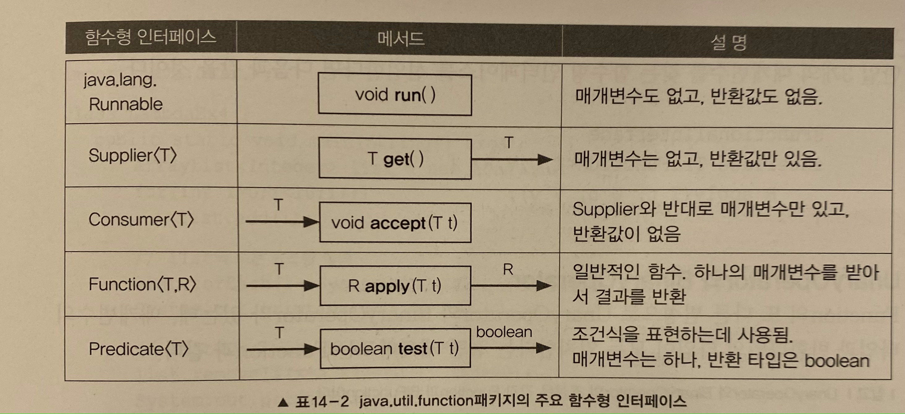

# 1. 람다

## 1-1. 람다식
람다식이란, 간단히 말해서 하나의 메서드를 식으로 나타낸 것을 말한다. 람다식은 함수를 간략하면서도 명확한 식으로 표현할 수 있게 해준다.

```java
/** 람다식을 사용한 경우 **/
int[] arr = new int[5];
Arrays.setAll(arr, (i) -> (int) (Math.random() * 5)+1);

/** 람다식을 사용하지 않은 경우 **/
int method() {
  return (int) (math.random() * 5) + 1; 
}
```

## 1-2. 람다식 작성하기
람다식은 "익명 함수"이다. 람다식은 아래와 같은 방법으로 작성해 나아갈 수 있다.
  1. 익명 함수 답게 메서드에서 이름과 반환타입을 제거하고 매개변수 선언부와 몸통 "{}" 사이에 "->" 를 추가한 형태이다. 
  2. 반환값이 존재할 경우, return 문 대신에 식으로 대신할 수 있다. 식이므로, 해당 식의 끝에는 ";"가 붙지않는다.
  3. 추론 가능한 경우, 선언된 매개변수에 타입을 생략하여 사용할 수 있다.


## 1-3. 함수형 인터페이스(Functional Interface
자바에서 모든 메서드는 클래스 내에 포함되어야 하는데, 람다식은 어떤 클래스에 속하여 있는 것일까? **사실 람다식은 익명 클래스의 객체와 동일하다.** 
아래의 예시를 통하여 살펴보도록 하자.


아래와 같이 max()라는 메서드가 정의된 MyFunction인터페이스가 정의되어 있다고 가정하자. 
```java
interface MyFunction {
  public abstract int max(int a, int b);
}
```


그리고 이 인터페이스를 구현한 익명 클래스의 객체는 다음과 같이 생성 및 사용할 수 있다.
```java
MyFunction f = new MyFunction() {
                  public int max(int a, int b) {
                    return a > b ? a : b;     
                  }
               };
               
int big = f.max(5, 3);
System.out.println(big);
// result : 5
```


MyFunction 에 정의된 메서드는 람다식 메서드의 선언부와 일치한다. 따라서 아래와 같이 대체할 수 있다.
```java
MyFunction f = (int a, int b) -> a > b ? a : b;
int big = f.max(5, 3);
}
```


**이렇게 사용이 가능한 이유는 사실 람다식이 익명 객체이기 때문이다.** 이 때 인터페이스에서 선언한 메서드와 매개변수의 타입과 개수 그리고 반환값이 일치하여야 한다.
이 때 MyFunction을 함수형 인터페이스라고 한다. **@FunctionalInterface** 를 붙이면 컴파일러가 함수형 인터페이스를 올바르게 정의하였는지 확인해 주므로, 꼭 붙이도록 한다.
```java
@FunctionalInterface
interface MyFunction {
  public abstract int max(int a, int b);
}
```

## 1-4. 람다식의 타입과 형변환
람다식은 익명 객체이고, 익명 객체는 타입이 없다. 단지 함수형 인터페이스로 람다식을 참조할 수 있는 것일 뿐이다. 정확히 말하자면 람다식도 타입이 존재하나, 컴파일러가 임의로 이름을 정하기 때문에 알 수 없다. 그래서 대입 연산자를 이용할 때는 아래와 같이 형변환이 필요하다.
```java
/**  Functional Interface **/
@FunctionalInterface
interface MyFunction {
  void method();
}

/** 인터페이스 구현부 **/
MyFunction f = (MyFunction) (() -> {});
```

위에서 람다식이 MyFunction 인터페이스를 직접 구현하지는 않았지만, 이 인터페이스를 구현한 클래스의 객체와 완전히 동일하기 때문에 위와 같은 형변환이 가능하며, 이 형변환은 생략이 가능하다.

하지만 아래와 같이 Object 타입으로는 받을 수 없다. 람다식은 오직 함수형 인터페이스만으로 형변환이 가능하다.
```java
 Object obj = (Object) (() -> {}); // ERROR
```

## 1-5. java.util.function 패키지
대부분의 메서드는 타입이 비슷하다. 매개변수가 없거나, 한개 또는 두개를 가지며, 반환값은 없거나, 한 개, 게다가 제네릭 메서드로 정의하면 매개변수나 반환타입이 달라도 문제가 되지 않는다. 그래서 java.util.function 패키지 내에 일반적으로 자주 쓰이는 형식의 메서드를 미리 정의하였다. 

*가능하면 아래의 미리 정의된 메서드를 사용하도록 하자.*

<p align="center">
  
</p>


#### 조건식 표현에 사용되는 Predicate
```java
// 조건식 정의
Predicate<String> isEmptyStr = s -> s.length() == 0;

String s = "";	

if(isEmptyStr.test(s)) {
  System.out.println("This is Empty String");
}

// result : This is Empty String
}
```

# 2. 스트림
스트림이란 데이터소스를 추상화하고, 데이터를 다루는데 자주 사용되는 것들을 정의해 두었다. 데이터 소스를 추상화함으로써 데이터 소스가 무엇이든 간에 같은 방식으로 다룰 수 있게 되었다는 것을 의미한다. 이는 곧 코드의 재사용성이 높아진다는 것을 알 수 있다.


## 2-1. 스트림 예시
아래와 같이 배열이 존재한다고 가정하자. 해당 배열에 대하여 정렬된 배열의 값을 출력하는 방법은 아래와 같다.
```java
String[] strArr = {"a", "b", "c", "d"};

List<String> strList = Arrays.asList(strArr);

Collections.sort(strList);

for(String str : strList) {
  System.out.println(str);
}
```

위의 에시를 스트림을 사용한다면, 아래와 같이 간단하게 표현할 수 있다.
```java
String[] strArr = {"a", "b", "c", "d"};

List<String> strList = Arrays.asList(strArr);

strList.stream().sorted().forEach(System.out::println);
```

## 2-2. 스트림의 특징

##### 1) 스트림은 데이터 소스를 변경하지 않는다.
스트림은 데이터소스를 변경하지 않는다. 데이터 소스로부터 데이터를 읽기만 할 뿐이다. 허나 필요하다면 정렬된 결과를 따로 담아서 반환할 수도 있다.
```java
String[] strArr = {"a", "b", "c", "d"};

List<String> strList = Arrays.asList(strArr);
		
List<String> sortedList = strList.stream().sorted().collect(Collectors.toList());
```

##### 2) 스트림은 일회용이다.
스트림은 Iterator 와 마찬가지로 일회용이다. 한번 사용하면 닫혀서 다시 사용할 수 없다. 다시 사용하기 위해서는 스트림을 다시 생성하여야만 한다.

##### 3) 스트림은 작업을 내부 반복으로 처리한다.
스트림의 forEach 내부에는 for문이 숨어있다. 수행할 작업을 매개변수로 받아서 반복문을 수행한다.
```java
void forEach(Consumer<? super T> action) {
  Objects.requireNonNull(action);
  
  for(T t : action) { // 내부 반복
    action.accept(T);
  }
}
```

##### 4) 스트림의 연산
스트림이 제공하는 다양한 연산을 이용해서 복잡한 작업들을 간단하게 처리할 수 있다. 스트림이 제공하는 연산은 중간 연산과 최종 연산으로 분류할 수 있는데, 중간 연산은 연산결과를 스트림으로 반환하기 때문에 중간 연산을 연속해서 연결하여 사용할 수 있다. 반면에 최종 연산은 스트림의 요소를 소모하여 수행하므로 단 한번의 연산만이 가능하다.

##### 5) 병렬 스트림
스트림을 병렬 스트림으로 변환하는 것은 어렵지 않다. 생성된 스트림에 parallel()을 붙히기만 하면 된다. 기본값은 sequential이므로, 그 외의 스트림은 따로 지정하지 않아도 된다.

**허나 병렬 처리가 항상 빠른 것은 아님에 항상 유의하자.**

```java
String[] strArr = {"a", "b", "c", "e", "d"};
		
List<String> strList = Arrays.asList(strArr);

int sum = strList.stream().parallel().mapToInt(s -> s.length()).sum();
		
System.out.println("Sum : " + sum);

// result : 5
```

## 2-3. 람다식 - Iterate(), generate()
Stream Class 의 iterate() 와 generate()는 람다식을 매개변수로 받아서, 이 람다식에 의하여 계산되는 값들을 요소로 하는 스트림을 다시 생성하는 것을 의미한다.
```java
/** iterate() **/
Stream<Integer> evenStream = Stream.iterate(0, n -> n + 2); // 0, 2, 4, 6 . . . 

/** generate() **/
Stream<Integer> onceStream = Stream.generate(() -> 1); // 1, 1, 1, 1, 1 . . .
```
위에서 보는 것과 같이 iterate() 는 전에 들어온 요소(seed)를 이용하여 다음 스트림 값을 계산하지만, generate()는 이전 결과를 이용하지 않는다는 차이가 있다.

*iterate() 혹은 generate()를 통하여 생성된 스트림은 기본현 스트림 타입의 참조 변수로 다룰 수 없다.*
```java
IntStream evenStream = Stream.iterate(0, n->n+2); // ERROR
```


