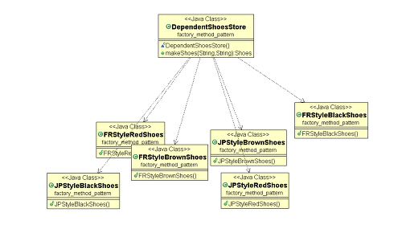
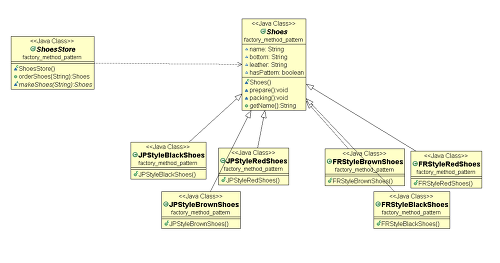

# 1. Abstract Factory 🏭
## 1-1. Abstract Factory Pattern 분류
추상 팩토리 패턴은 생성(Creational)패턴 중 하나이다.

### 생성(Creational)패턴이란?
- 생성 패턴이란 객체 생성에 관련된 패턴을 의미한다. 
- 객체의 생성과 조합을 캡슐화해 특정 객체가 생성 혹은 변경되어도 프로그램 구조에 영향을 크게 받지 않도록 유연성을 제공하는 역할을 한다.

## 1-2. Abstract Factory Pattern 특징
- 추상 팩토리 패턴이란, 구체적인 클래스에 의존하지 않고 서로 연관되거나 의존적인 객체들의 조합을 만드는 인터페이스를 제공하는 패턴을 의미한다. 
- 즉, **관련성있는** 여러 종류의 객체를 **일관된 방식으로 생성**하는 경우에 유용한 디자인 패턴이다. 

## 1-3. Abstract Factory Pattern 활용
아래와 같이 style 과 name 을 파라미터로 받아 구두를 제작하는 신발 가게가 존재한다고 가정하자.

```java
class ShoesStore {
  public Shoes makeShoes(String style, String name) {
        Shoes shoes = null;
        if (style.equals("Japan")) {
            if (name.equals("blackShoes")) shoes = new JPStyleBlackShoes();
            else if (name.equals("brownShoes")) shoes = new JPStyleBrownShoes();
            else if(name.equals("redShoes")) shoes = new JPStyleRedShoes();
        }
        else if(style.equals("france")) {  
            if (name.equals("blackShoes")) shoes = new FRStyleBlackShoes();
            else if (name.equals("brownShoes")) shoes = new FRStyleBrownShoes();
            else if(name.equals("redShoes")) shoes = new FRStyleRedShoes(); 
        }
        shoes.prepare();
        shoes.packing();
        return shoes;
    }
}
```

현재 객체들의 관계를 나타낸 UML은 다음과 같다.
<p align="center">
  
</p>

이 때, 신발가게(고수준 컴포넌트)는 각각의 신발들(저수준 컴포넌트)에 대하여 의존성이 매우 높다. 

***즉, 신발이 추가될 때마다 신발가게가 수정되어야 하는 할 일이 생긴다.***

위 설계는 객체지향 설계 5대 원칙 SOLID 중, 5번째 ***DIP***를 따르도록 재설계하여야 한다.

### 여기서 SOLID 원칙이란?
```
1. SRP (Single Responsibility Principle)
- 단일 책임 원칙이라고 한다. 
- 한 클래스는 하나의 책임만 가져야 한다.

2. OCP (Open / Close Principle)
- 개방-폐쇄 원칙이라고 한다. 
- 소프트웨어 요소는 확장에는 열려 있으나 변경에는 닫혀있어야 한다.

3. LSP (Liskov Substitution Principle)
- 리스코프 치환 원칙이라고 한다. 
- 프로그램의 객체는 프로그램의 정확성을 깨트리지 않으면서 하위 타입의 인스턴스로 바꿀 수 있어야 한다.

4. ISP (Interface Segregation Principle)
- 인터페이스 분리 원칙이라고 한다. 
- 특정 클라이언트를 위한 인터페이스 여러 개가 범용 인터페이스 하나보다 낫다.

5. DIP (Dependency Inversion Principle)
- 의존관계 역전 원칙이라고 한다. 
- 프로그래머는 추상화에 의존해야하지, 구체화에 의존하면 안된다. (의존성 주입은 이 원칙을 따르는 방법 중 하나다.)
```

DIP 원칙에 따라 Interface 를 이용하여 재설계된 신발가게 객체들의 UML 은 다음과 같다. 

<p align="center">
  
</p>

*Shoes라는 인터페이스를 추가하여, 고수준 컴포넌트가 구상 클래스에 의존하던 것을 추상화된 것에 의존하도록 만들었다.*

## 1-4. Abstract Factory Pattern 장단점
- 장점
1. 


# 출처
- https://ko.wikipedia.org/wiki/SOLID_(%EA%B0%9D%EC%B2%B4_%EC%A7%80%ED%96%A5_%EC%84%A4%EA%B3%84)
- https://gmlwjd9405.github.io/2018/08/08/abstract-factory-pattern.html
- https://velog.io/@bae_mung/%EB%94%94%EC%9E%90%EC%9D%B8-%ED%8C%A8%ED%84%B4-%EC%83%9D%EC%84%B1-Abstract-Factory-Pattern
