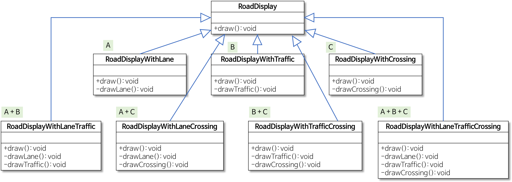
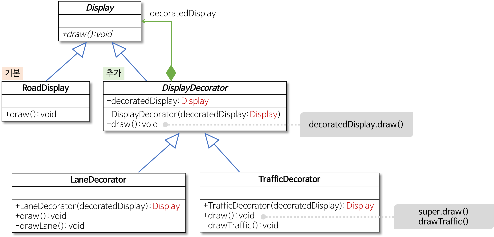
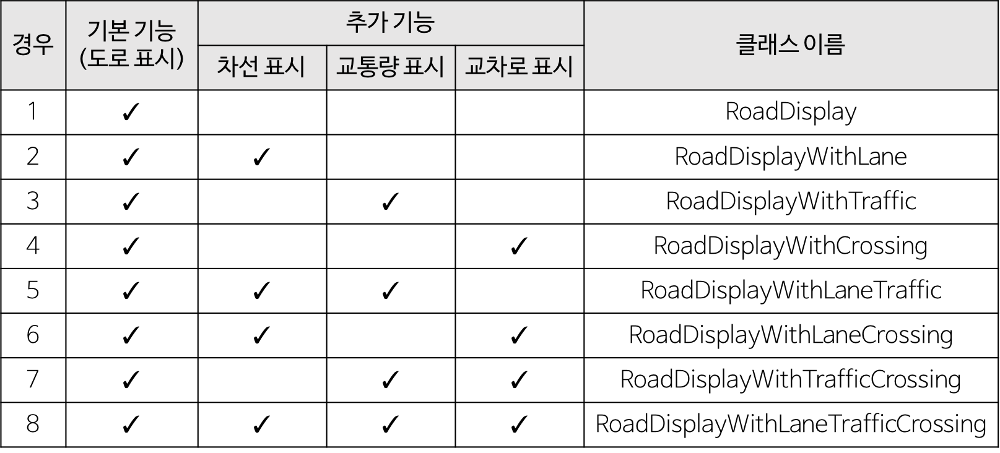

# 2. Decorator Pattern
- Decorator Pattern 이란, 하나의 중심이 되는 객체에 기능(장식)을 하나씩 추가하면서 목적에 맞는 객체를 만들어가는 패턴을 말한다.
- 즉, 기본 기능 하나에 추가될 기능들을 각각 구현하여, 사용 시 조합하여 하나의 객체처럼 사용하도록 한다.
- Decorator Pattern 은 구조(Structural Pattern)에 속한다.

## 2-1. 구조 패턴이란?
- 구조 패턴이란 객체를 조합하여 더 큰 객체를 조합해 나아가는 패턴을 의미한다.
- 예를 들어 서로 다른 인터페이스를 지닌 2개의 객체를 묶어 단일 인터페이스를 제공하거나 객체들을 서로 묶어 새로운 기능을 제공하는 패턴이다.

### 2-1-1. 구조 패턴의 특징
- 서로 독립적인 클래스를 하나의 클래스처럼 사용할 수 있다.
- 여러 인터페이스를 합성하여 서로 다른 인터페이스들의 통일된 추상을 제공한다.

## 2-2. Decorator Pattern Structure
- Decorator Pattern 의 기본적인 UML 은 다음과 같다.  
#
<p align="center">
  
</p>

- UML 의 각 요소별 설명은 아래와 같다.

|클래스|기능|역할|
|---|---|---|
|Component|ComponentConcrete Component + Decorator|Client 가 실제로 사용하는 객체|
|ConcreteComponent|기본 기능을 구현한 클래스|모든 Decorator가 공통으로 가지는 기능
|Decorator|많은 수의 Decorator 구현체의 공통 기능을 제공|Decorator Interface|
|ConcreteDecoratorA, ConcreteDecoratorB|추가 기능(Decorator) 제공|각자 구현한 혹은 조합한 기능|

## 2-3. Decorator Pattern Example
- 네비게이션에 도로를 표시하는 기능이 있다고 하자.
- 해당 네비게이션에는 기본적으로 선(길)만 나타내는 방식이 있고, 추가로 다른 것들을 표시할 수도 있다.
- 아래는 기본 도로를 표시하는 클래스와 기본 도로에 더하여 차선을 표시하는 코드의 예시이다.

#### 기본 도로 표시
```java
// 기본 도로 표시 클래스
public class RoadDisplay {
    public void draw() { System.out.println("기본 도로 표시"); }
}
```

#### 기본 도로 표시 + 차선 표시 클래스
```java
// 기본 도로 표시 + 차선 표시 클래스
public class RoadDisplayWithLane extends RoadDisplay {
  public void draw() {
      super.draw(); // 상위 클래스, 즉 RoadDisplay 클래스의 draw 메서드를 호출해서 기본 도로 표시
      drawLane(); // 추가적으로 차선 표시
  }
  private void drawLane() { System.out.println("차선 표시"); }
}
```

#### Client
```java
// Client
public class Client {
  public static void main(String[] args) {
      RoadDisplay road = new RoadDisplay();
      road.draw(); // 기본 도로만 표시

      RoadDisplay roadWithLane = new RoadDisplayWithLane();
      roadWithLane.draw(); // 기본 도로 표시 + 차선 표시
  }
}
```

- 만약 여기서 특정 사용자는 교통량도 표시하도록 설정하였다면? 
- 만약 여기서 특정 사용자는 교통량과 함께 횡단보도도 표시하도록 설정하였다면?
- 이렇듯 다음과 같이 여러 기능을 조합하여 하는 경우가 발생할 수 있다.
<p align="center">
  
</p>
  
#

- 위의 Decorator 들을 축약하여 Decorator Pattern 에 사용되는 구성요소를 전부 표현하면 아래의 그림과 같다.
<p align="center">
  
</p>
  
#
- 예시를 위의 Decorator Pattern 구성요소와 Mapping한 결과는 아래와 같다.
|이름|역할|
|---|---|
|Display|Component|
|RoadDisplay|Concrete Component|
|DisplayDecorator|Decorator|
|LaneDecorator|Concrete Decorator|

- 이렇게 구성할 경우 중복되지 않게 이래의 수많은 기능들을 조합하여 사용할 수 있을 것이다.
<p align="center">
  
</p>
  
#

## 2-4. Decorator Pattern Pros & Cons
### 2-4-1. 장점
- 기능 확장을 위해 서브클래싱에 대한 유연한 대안을 제공한다.
- 구성과 위임을 통하여 런타임에 동작을 수정할 수 있다.

### 2-4-2. 단점
- 디자인에 많은 객체를 생성할 수 있고 남용 시 복잡할 수 있다.
- 클라이언트가 구성 요소의 구체적인 유형(Concrete Component)에 크게 의존하는 경우 데코레이터가 문제를 일으킬 수 있다.

## 2-5. Decorator Pattern Conclusion 
- 아래의 2가지와 같은 경우에 **Decorator Pattern**을 사용하자.
```
1) 클래스의 요소들을 계속해서 수정을 하면서 사용하는 구조가 필요한 경우
2) 여러 요소들을 조합해서 사용하는 클래스 구조인 경우
```

## 2-6. Source
- https://gmlwjd9405.github.io/2018/07/09/decorator-pattern.html
- https://coding-factory.tistory.com/713
