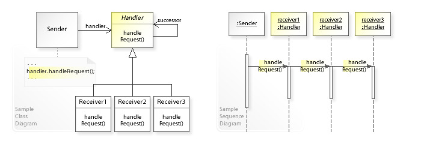

# 3. Chain Of Responsibility (COR)
- 어떤 요청이 그 요청을 담당하는 객체에 들어오면 각각의 요청에 대해서 특정한 객체가 담당하고, 요청을 수행하지 못하는 객체라면 다음 객체에 넘기며 책임을 넘기는 형태의 패턴을 말한다.
- 즉, 1가지 요청에 대하여 2개 이상의 객체에서 처리하고자 한다면, 해당 역할 사슬 패턴을 사용하면 된다.

## 3-1. 특징
- 각각의 처리 객체는 명령 객체를 처리할 수 있는 연산의 집합이고, 체인 안의 처리 객체가 핸들할 수 없는 명령은 다음 처리 객체로 넘겨진다.
- 처리해야할 요청이 도달할 경우, 체인의 처음 객체부터 체인의 끝까지 다시 반복된다.
- 모든 연산의 집합 거친 후에도 처리할 수 없는 값이 존재할 수 있다.

## 3-2. UML
<p align="center">
  
</p>

- Sender : Client 를 의미한다. 요청을 보내는 객체이다.
- Handler : 각각의 Reciever를 관리하는 객체이다. Receiver들의 순서를 설정할 수 있다.
- Receiver1, 2, 3 : 각각의 요청을 처리하는 객체이며, 요청을 처리하며, 자신이 할 수 없는 요청이 오면 다음 객체로 넘긴다.

## 3-3. 예시

## 3-4. 활용
1) Java의 try-catch 문
- Try 문에서 처리를 하고, 처리하지 못하는 요청(i.e. 에러)이 발생하면 catch 문으로 요청을 넘긴다.
- try-catch 의 원리에 대하여 찾아보고자 하였으나, 찾지 못하였음. 정말 try-catch 에도 Handler 가 존재할까?

## 3-5. 장단점
### 3-5-1. 장점
1) 요청에 대한 처리 순서를 제어할 수 있다.
2) 객체 간의 결합도를 감소시킬 수 있다. 요청을 처리하는 각각의 객체들은 다른 객체로 넘길지만 정하면 되고, 다른 객체에서 무슨 작업을 진행하는 지에 대해서는 몰라도 된다.
3) 작업을 수행하는 클랫, 작업을 호출하는 클래스를 분리할 수 있다. 즉, Single Responsibility Principle(단일 책임 원칙)을 지킬 수 있다.
4) 기존 클라이언트의 코드를 바꾸지 않고 새로운 핸들러를 추가할 수 있다. 즉, Open / Closed Principle(개방 / 폐쇄 원칙)을 지킬 수 있다.

#### 
```
ㅇㄴ
```


### 3-5-2. 단점
1) 처리되지 않는 요청이 존재할 수 있으며, 요청할 때의 시점에서는 이를 미리 알 수 없다.
2) Chain 간의 설계가 잘못될 경우 사이클이 발생할 수 있다.


