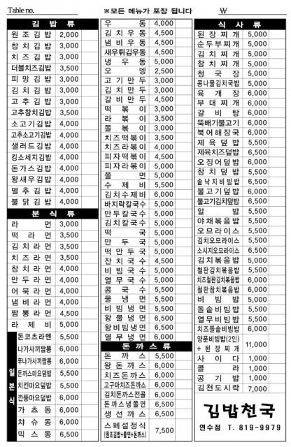

# 4. Command Pattern

## 4-1. 정의
- 실행될 기능을 캡슐화함으로써 주어진 여러 기능을 실행할 수 있는 재사용성이 높은 클래스를 설계하는 패턴

## 4-2. 예제코드
- 예시 : 손님(Client) -> 종업원(Invoker) -> 요리사(Receiver) -> 요리(Command) / 한식요리, 중식요리, 양식요리 (ConcreteCommand)

### 1) Before

#### 1. Cook
```java
public class Cook {
		
	public Cook () {
		
	}
		
	public void makeKoreanFood() {
		System.out.println("요리사가 한식을 만들었습니다.");
	}
	
	public void makeWesternFood() {
		System.out.println("요리사가 양식을 만들었습니다.");
	}
	
	public void makeJapaneseFood() {
		System.out.println("요리사가 일식을 만들었습니다.");
	}
	
}
```

#### 2. Part Timer
```java
public class PartTimer {
		
	private Cook cook;
		
	public PartTimer(Cook cook) {
		this.cook = cook;
	}
		
	public void order(String menu) {
			
		System.out.println("종업원이 받은 메뉴는 다음과 같습니다. : " + menu);
			
		switch (menu) {
		case "korean":
			cook.makeKoreanFood();
			break;
		case "western":
			cook.makeWesternFood();
			break;
		case "japanese":
			cook.makeJapaneseFood();
			break;
		default :
			System.out.println("메뉴판에 없는 메뉴입니다.");
			break;
		}
		
	}		
}
```

#### 3. Client
```java
public static void main(String[] args) {
		
	PartTimer partTimer = new PartTimer(new Cook());
		
	String[] menus = {"korean", "western", "japanese", "korean"};
		
	for(String menu : menus) {
		partTimer.order(menu);
	}
		
}	
```

##### 문제점 : 만약 여기서 새로운 메뉴(ex. 중식)가 추가된다면?
<p align="center">
  
</p>

### 2) After


## 4-3. 출처
https://gmlwjd9405.github.io/2018/07/07/command-pattern.html
